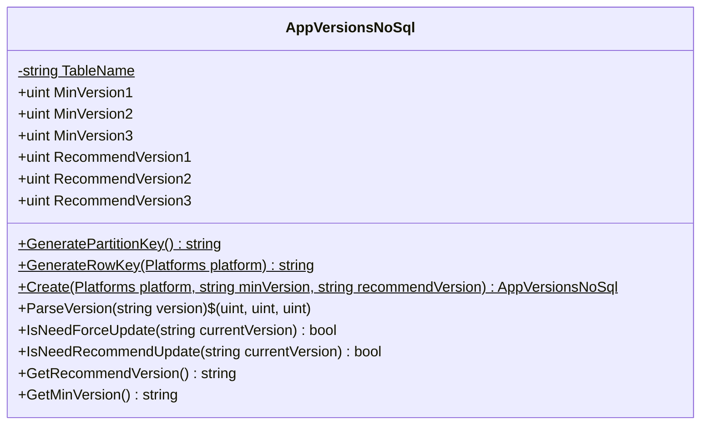
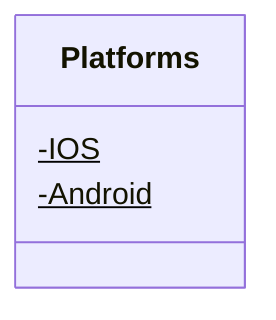

<!-- markdownlint-capture -->
<!-- markdownlint-disable -->

# Code Metrics

This file is dynamically maintained by a bot, *please do not* edit this by hand. It represents various [code metrics](https://aka.ms/dotnet/code-metrics), such as cyclomatic complexity, maintainability index, and so on.

## MyJetWallet.AppVersions :heavy_check_mark:

The *MyJetWallet.AppVersions.csproj* project file contains:

- 1 namespaces.
- 2 named types.
- 98 total lines of source code.
- Approximately 31 lines of executable code.
- The highest cyclomatic complexity is 6 :heavy_check_mark:.

  <strong id="myjetwallet-appversions">
    MyJetWallet.AppVersions :heavy_check_mark:
  </strong>

 

The `MyJetWallet.AppVersions` namespace contains 2 named types.

- 2 named types.
- 98 total lines of source code.
- Approximately 31 lines of executable code.
- The highest cyclomatic complexity is 6 :heavy_check_mark:.

  <strong id="appversionsnosql">
    AppVersionsNoSql :heavy_check_mark:
  </strong>

 

- The `AppVersionsNoSql` contains 15 members.
- 96 total lines of source code.
- Approximately 29 lines of executable code.
- The highest cyclomatic complexity is 6 :heavy_check_mark:.

| Member kind | Line number | Maintainability index | Cyclomatic complexity | Depth of inheritance | Class coupling | Lines of source / executable code |
| :-: | :-: | :-: | :-: | :-: | :-: | :-: |
| Method | <a href='https://github.com/MyJetWallet/MyJetWallet.AppVersions/blob/master/src/MyJetWallet.AppVersions/AppVersionsNoSql.cs#L27' title='AppVersionsNoSql AppVersionsNoSql.Create(Platforms platform, string minVersion, string recommendVersion)'>27</a> | 71 | 1 :heavy_check_mark: | 0 | 3 | 21 / 4 |
| Method | <a href='https://github.com/MyJetWallet/MyJetWallet.AppVersions/blob/master/src/MyJetWallet.AppVersions/AppVersionsNoSql.cs#L16' title='string AppVersionsNoSql.GeneratePartitionKey()'>16</a> | 100 | 1 :heavy_check_mark: | 0 | 0 | 1 / 1 |
| Method | <a href='https://github.com/MyJetWallet/MyJetWallet.AppVersions/blob/master/src/MyJetWallet.AppVersions/AppVersionsNoSql.cs#L17' title='string AppVersionsNoSql.GenerateRowKey(Platforms platform)'>17</a> | 100 | 1 :heavy_check_mark: | 0 | 2 | 1 / 1 |
| Method | <a href='https://github.com/MyJetWallet/MyJetWallet.AppVersions/blob/master/src/MyJetWallet.AppVersions/AppVersionsNoSql.cs#L99' title='string AppVersionsNoSql.GetMinVersion()'>99</a> | 93 | 1 :heavy_check_mark: | 0 | 0 | 1 / 1 |
| Method | <a href='https://github.com/MyJetWallet/MyJetWallet.AppVersions/blob/master/src/MyJetWallet.AppVersions/AppVersionsNoSql.cs#L98' title='string AppVersionsNoSql.GetRecommendVersion()'>98</a> | 93 | 1 :heavy_check_mark: | 0 | 0 | 1 / 1 |
| Method | <a href='https://github.com/MyJetWallet/MyJetWallet.AppVersions/blob/master/src/MyJetWallet.AppVersions/AppVersionsNoSql.cs#L68' title='bool AppVersionsNoSql.IsNeedForceUpdate(string currentVersion)'>68</a> | 66 | 6 :heavy_check_mark: | 0 | 2 | 14 / 7 |
| Method | <a href='https://github.com/MyJetWallet/MyJetWallet.AppVersions/blob/master/src/MyJetWallet.AppVersions/AppVersionsNoSql.cs#L83' title='bool AppVersionsNoSql.IsNeedRecommendUpdate(string currentVersion)'>83</a> | 66 | 6 :heavy_check_mark: | 0 | 2 | 14 / 7 |
| Property | <a href='https://github.com/MyJetWallet/MyJetWallet.AppVersions/blob/master/src/MyJetWallet.AppVersions/AppVersionsNoSql.cs#L19' title='uint AppVersionsNoSql.MinVersion1'>19</a> | 100 | 2 :heavy_check_mark: | 0 | 0 | 1 / 0 |
| Property | <a href='https://github.com/MyJetWallet/MyJetWallet.AppVersions/blob/master/src/MyJetWallet.AppVersions/AppVersionsNoSql.cs#L20' title='uint AppVersionsNoSql.MinVersion2'>20</a> | 100 | 2 :heavy_check_mark: | 0 | 0 | 1 / 0 |
| Property | <a href='https://github.com/MyJetWallet/MyJetWallet.AppVersions/blob/master/src/MyJetWallet.AppVersions/AppVersionsNoSql.cs#L21' title='uint AppVersionsNoSql.MinVersion3'>21</a> | 100 | 2 :heavy_check_mark: | 0 | 0 | 1 / 0 |
| Method | <a href='https://github.com/MyJetWallet/MyJetWallet.AppVersions/blob/master/src/MyJetWallet.AppVersions/AppVersionsNoSql.cs#L49' title='(uint, uint, uint) AppVersionsNoSql.ParseVersion(string version)'>49</a> | 70 | 2 :heavy_check_mark: | 0 | 4 | 18 / 6 |
| Property | <a href='https://github.com/MyJetWallet/MyJetWallet.AppVersions/blob/master/src/MyJetWallet.AppVersions/AppVersionsNoSql.cs#L23' title='uint AppVersionsNoSql.RecommendVersion1'>23</a> | 100 | 2 :heavy_check_mark: | 0 | 0 | 1 / 0 |
| Property | <a href='https://github.com/MyJetWallet/MyJetWallet.AppVersions/blob/master/src/MyJetWallet.AppVersions/AppVersionsNoSql.cs#L24' title='uint AppVersionsNoSql.RecommendVersion2'>24</a> | 100 | 2 :heavy_check_mark: | 0 | 0 | 1 / 0 |
| Property | <a href='https://github.com/MyJetWallet/MyJetWallet.AppVersions/blob/master/src/MyJetWallet.AppVersions/AppVersionsNoSql.cs#L25' title='uint AppVersionsNoSql.RecommendVersion3'>25</a> | 100 | 2 :heavy_check_mark: | 0 | 0 | 1 / 0 |
| Field | <a href='https://github.com/MyJetWallet/MyJetWallet.AppVersions/blob/master/src/MyJetWallet.AppVersions/AppVersionsNoSql.cs#L8' title='string AppVersionsNoSql.TableName'>8</a> | 93 | 0 :heavy_check_mark: | 0 | 0 | 1 / 1 |

<a href="#AppVersionsNoSql-class-diagram">:link: to `AppVersionsNoSql` class diagram</a>

<a href="#myjetwallet-appversions">:top: back to MyJetWallet.AppVersions</a>

  <strong id="appversionsnosql-platforms">
    AppVersionsNoSql.Platforms :heavy_check_mark:
  </strong>

 

- The `AppVersionsNoSql.Platforms` contains 2 members.
- 5 total lines of source code.
- Approximately 2 lines of executable code.
- The highest cyclomatic complexity is 0 :heavy_check_mark:.

| Member kind | Line number | Maintainability index | Cyclomatic complexity | Depth of inheritance | Class coupling | Lines of source / executable code |
| :-: | :-: | :-: | :-: | :-: | :-: | :-: |
| Field | <a href='https://github.com/MyJetWallet/MyJetWallet.AppVersions/blob/master/src/MyJetWallet.AppVersions/AppVersionsNoSql.cs#L13' title='Platforms.Android'>13</a> | 93 | 0 :heavy_check_mark: | 0 | 0 | 1 / 1 |
| Field | <a href='https://github.com/MyJetWallet/MyJetWallet.AppVersions/blob/master/src/MyJetWallet.AppVersions/AppVersionsNoSql.cs#L12' title='Platforms.IOS'>12</a> | 93 | 0 :heavy_check_mark: | 0 | 0 | 1 / 1 |

<a href="#AppVersionsNoSql.Platforms-class-diagram">:link: to `AppVersionsNoSql.Platforms` class diagram</a>

<a href="#myjetwallet-appversions">:top: back to MyJetWallet.AppVersions</a>

<a href="#myjetwallet-appversions">:top: back to MyJetWallet.AppVersions</a>

## Metric definitions

  - **Maintainability index**: Measures ease of code maintenance. Higher values are better.
  - **Cyclomatic complexity**: Measures the number of branches. Lower values are better.
  - **Depth of inheritance**: Measures length of object inheritance hierarchy. Lower values are better.
  - **Class coupling**: Measures the number of classes that are referenced. Lower values are better.
  - **Lines of source code**: Exact number of lines of source code. Lower values are better.
  - **Lines of executable code**: Approximates the lines of executable code. Lower values are better.

## Mermaid class diagrams

##### `AppVersionsNoSql` class diagram

##### `AppVersionsNoSql.Platforms` class diagram

*This file is maintained by a bot.*

<!-- markdownlint-restore -->
